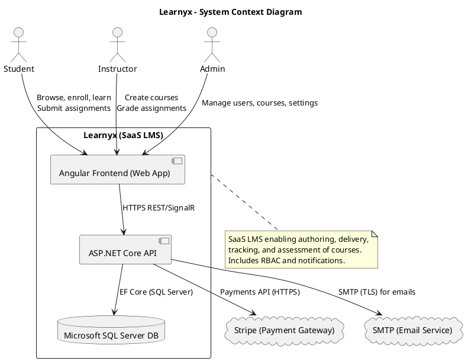
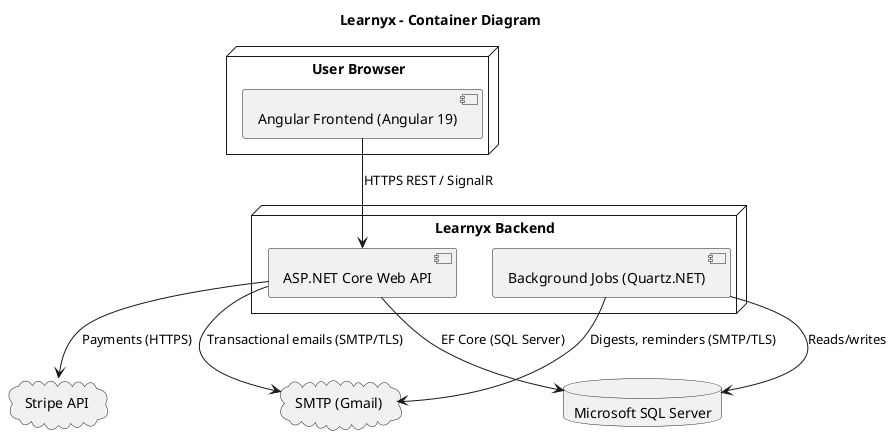
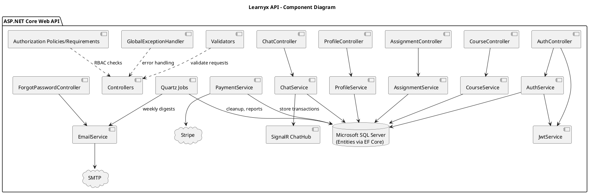
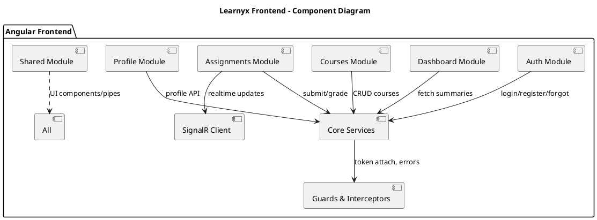

## Learnyx C4 Model Documentation

This document describes the Learnyx SaaS Learning Management System using the C4 model, from high-level system context down to container and component interactions, plus an optional deployment/code view.

---

### C4 Level 1 — System Context

Learnyx is an online platform for delivering, managing, and tracking courses. It is used by Students, Instructors, and Admins, and integrates with external services for payments and email.

- Student: Enrolls in courses, submits assignments, tracks progress.
- Instructor: Creates courses and assignments, grades students.
- Admin: Manages users, courses, and system settings.
- External Systems: Stripe (payments), SMTP (email service).



Notes:

- All user roles access Learnyx via a browser-based Angular application.
- The API is the single entry point for business operations and integrates with the database and external services.
- Role-based access control (RBAC) is enforced at the API level.

---

### C4 Level 2 — Container Diagram

Learnyx is composed of several containers that collaborate to deliver functionality.

Containers Overview:

| Container                     | Responsibilities                                                                                                   | Technology                                                            | Data                                        | Interfaces                                   |
| ----------------------------- | ------------------------------------------------------------------------------------------------------------------ | --------------------------------------------------------------------- | ------------------------------------------- | -------------------------------------------- |
| Angular Frontend (Web App)    | UI/UX for Students, Instructors, Admins; authentication flows; forms; dashboards; real-time updates                | Angular 19, TypeScript, RxJS, HTML/SCSS                               | Browser storage (tokens); cached view state | HTTPS to API; WebSocket/SignalR for realtime |
| ASP.NET Core Web API          | REST endpoints; auth & RBAC; course/assignment management; grading; profiles; chat; orchestrates external services | .NET 8, ASP.NET Core, EF Core (SQL Server), FluentValidation, SignalR | N/A (stateless)                             | HTTPS REST; SignalR; SMTP; Stripe            |
| Microsoft SQL Server Database | Persistent storage for users, courses, modules, lessons, assignments, submissions, grades, messages                | SQL Server                                                            | Relational data; migrations                 | SQL via EF Core (SqlServer provider)         |
| Background Jobs               | Scheduled tasks: email digests, cleanup, reminders, report generation                                              | Quartz.NET                                                            | N/A (stateless; reads/writes DB)            | Internal job runners; SMTP; API services     |
| SMTP Email Service            | Outbound transactional email and digests                                                                           | SMTP (Gmail)                                                          | N/A                                         | SMTP over TLS                                |
| Stripe Payment Gateway        | Payment processing for enrollments                                                                                 | Stripe API                                                            | N/A                                         | HTTPS Stripe API                             |



Notes:

- The API is stateless and horizontally scalable.
- Background jobs run on a schedule using Quartz.NET and rely on the same database and SMTP.
- Frontend consumes REST endpoints and can subscribe to real-time channels via SignalR (e.g., chat, live updates).

---

### C4 Level 3 — Component Diagrams

Internal components for the two key containers: the ASP.NET Core API and the Angular Frontend.

API Components:

| Component                                                             | Responsibility                                                                | Technology/Notes                      |
| --------------------------------------------------------------------- | ----------------------------------------------------------------------------- | ------------------------------------- |
| Controllers (Auth, Course, Assignment, Profile, Chat, ForgotPassword) | HTTP layer; request/response handling; routing                                | ASP.NET Core MVC Controllers          |
| Authentication & JWT Service                                          | Login, registration, social auth (Google/Facebook), token issuance/validation | JWT, OAuth providers                  |
| Authorization (Policies/Requirements)                                 | Role- and policy-based access control                                         | ASP.NET Core Authorization            |
| Services (Domain/Application)                                         | Business logic for courses, assignments, grading, profiles, chat              | C# services; unit-of-work patterns    |
| Validators                                                            | Request validation                                                            | FluentValidation                      |
| Data Access                                                           | Persistence operations; mapping between entities and DTOs                     | EF Core (SqlServer), LINQ, Migrations |
| SignalR Hub                                                           | Real-time messaging (chat, notifications)                                     | SignalR                               |
| Email Service                                                         | Transactional emails, templates                                               | SMTP client, templates                |
| Payment Integration                                                   | Payment initialization, webhooks, reconciliation                              | Stripe SDK/API                        |
| Background Jobs                                                       | Scheduled tasks (digests, cleanups)                                           | Quartz.NET jobs                       |
| Global Exception Handling                                             | Consistent error responses, logging                                           | Middleware/filters                    |



Angular Frontend Components:

| Component/Module                               | Responsibility                                        | Technology/Notes                        |
| ---------------------------------------------- | ----------------------------------------------------- | --------------------------------------- |
| Auth Module (Login, Register, Forgot Password) | Authentication flows; token handling                  | Angular, Forms, Interceptors            |
| Dashboard (Student/Instructor)                 | Personalized dashboards; KPIs                         | Angular components, RxJS streams        |
| Courses Module                                 | Browse, create, edit, view course content             | Angular routing, forms, guards          |
| Assignments Module                             | Create, submit, grade assignments; feedback           | Angular forms, file uploads             |
| Profile Module                                 | Profile view/edit; avatar, bio                        | Angular services                        |
| Shared Module                                  | UI components, pipes, helpers                         | Reusable components                     |
| Core Services                                  | ApiService, AuthService, ProfileService, Interceptors | Centralized HTTP, token, error handling |
| Guards/Resolvers                               | AuthGuard, RoleGuard; prefetch data                   | Routing guards                          |
| Realtime                                       | Chat UI and notifications                             | SignalR client                          |
| State (lightweight)                            | Local component state; RxJS Subjects/BehaviorSubjects | RxJS; can be extended                   |



Interaction Notes:

- HTTP interceptor attaches JWT to API calls; guards enforce route access by role.
- SignalR client subscribes to channels for chat and notifications.

---

### C4 Level 4 — Deployment / Code View (Optional)

Deployment Overview:

| Node                      | Description                             | Technology                               |
| ------------------------- | --------------------------------------- | ---------------------------------------- |
| Web Browser               | End-user device running the Angular app | Any modern browser                       |
| CDN/Static Hosting        | Serves Angular build artifacts          | e.g., CloudFront/Azure CDN               |
| API App Service/Container | Hosts ASP.NET Core API and SignalR      | Docker/Kubernetes or managed app service |
| Background Job Worker     | Runs Quartz.NET schedulers              | Separate container/worker                |
| Microsoft SQL Server      | Managed database service                | SQL Server                               |
| SMTP                      | External mail provider                  | Gmail SMTP                               |
| Stripe                    | External payment processor              | Stripe API                               |

```text
+------------------+         HTTPS         +----------------------+
|  User Browser    |  <------------------> |  CDN / Static Host   |
| (Angular App)    |                      | (Angular artifacts)  |
+---------+--------+                      +----------+-----------+
          |                                           |
          | HTTPS                                     |
          v                                           v
+---------+-------------------------------------------+-----------+
|                 API App (ASP.NET Core / SignalR)                |
|  - Controllers / Auth / Services / Payment / Email / Hub        |
|  - Env vars: DB conn, SMTP creds, Stripe keys                   |
+---------+------------------------+---------------------+---------+
          |                        |                     |
          | EF Core (SQL Server)   | SMTP/TLS            | HTTPS
          v                        v                     v
   +------+-------------+   +------+---------+   +------+--------+
   | Microsoft SQL      |   |   SMTP/Gmail   |   |  Stripe API   |
   | Server             |   +----------------+   +---------------+
   +--------------------+

                     +----------------------------+
                     | Background Jobs (Quartz)   |
                     | - Digests / cleanups       |
                     | - Uses DB + SMTP           |
                     +-------------+--------------+
                                   |
                                   v
                             +-----+--------------+
                             | Microsoft SQL      |
                             | Server             |
                             +--------------------+
```

Code-Structure Highlights (API):

- Controllers in `backend/Controllers/` encapsulate HTTP routing.
- Services in `backend/Services/Implementation/` contain business logic.
- Interfaces in `backend/Services/Interfaces/` define contracts.
- Authentication in `backend/Authentication/Implementation/` (JWT & OAuth providers).
- Data in `backend/Data/` with EF Core `DataContext` and `backend/Migrations/`.
- Real-time hub in `backend/Hubs/ChatHub.cs`.
- Validators in `backend/Validators/`.
- Global exception handling in `backend/Exceptions/GlobalExceptionHandler.cs`.

Security, Observability, and Reliability:

- Security: JWT-based auth, HTTPS, OAuth social logins, RBAC via policies/requirements, server-side validation, OWASP best practices for inputs.
- Observability: Structured logging; centralized exception handling; health checks; request metrics (expandable to APM).
- Reliability: Idempotent payment handlers; retry policies for email; background jobs for deferred tasks; database migrations.

---

### Cross-Cutting Concerns

- Authentication & Authorization:

  - JWT issuance and validation.
  - Role-based policies: Student, Instructor, Admin.
  - Guards on frontend routes; authorization attributes at API level.

- Validation:

  - FluentValidation on request DTOs.
  - Client-side form validation using Angular reactive forms.

- Error Handling:

  - Global exception handler at API to consistently shape error responses.
  - HTTP interceptor for frontend to map and display errors.

- Performance:

  - Pagination for lists; efficient EF Core queries.
  - Caching candidates: read-mostly course catalogs.
  - Lazy loading and code splitting in Angular.

- Notifications:

  - Email on key events (enrollment, assignments, weekly digest).
  - Real-time via SignalR for chat and live updates.

- Payments:
  - Stripe integration for checkout and webhooks for post-payment reconciliation.
  - Secure storage of minimal payment metadata; no card data stored.

---

### Appendix — Key Use Cases and Flows

- Student Enrollment (Paid):

  - Student selects course -> Frontend requests payment intent -> API calls Stripe -> Stripe returns client secret -> Frontend confirms payment -> Stripe webhook -> API validates and activates enrollment -> Email confirmation -> Enrollment visible in dashboard.

- Assignment Submission:

  - Student uploads submission -> API validates and stores -> Notifies instructor (email/realtime) -> Instructor grades -> Grade stored -> Student notified.

- Weekly Digest:
  - Quartz job queries activity (new content, deadlines, grades) -> Composes digest -> Sends via SMTP.

---