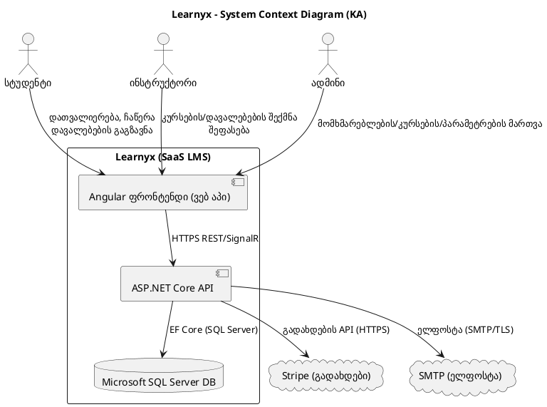
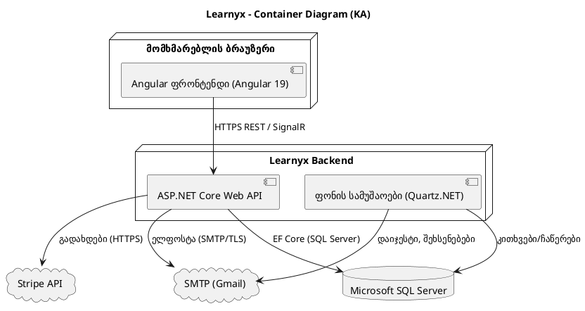

## Learnyx C4 Model Documentation

ეს დოკუმენტი აღწერს Learnyx SaaS სასწავლო მართვის სისტემას C4 მოდელით: სისტემური კონტექსტი, კონტეინერები, კომპონენტები და არჩევითი განთავსება/კოდის ხედი.

---

### C4 დონე 1 — სისტემური კონტექსტი

Learnyx არის ონლაინ პლატფორმა კურსების მიწოდებისთვის, მართვისა და პროგრესის თვალყურის დევნებისთვის. მას იყენებენ სტუდენტები, ინსტრუქტორები და ადმინისტრატორები; ინტეგრირდება გადახდებსა და ელფოსტასთან.

- სტუდენტი: ყიდულობს/ჩაეწერება კურსებზე, აგზავნის დავალებებს, აკვირდება პროგრესს.
- ინსტრუქტორი: ქმნის კურსებს/დავალებებს, აფასებს სტუდენტებს.
- ადმინისტრატორი: მართავს მომხმარებლებს, კურსებსა და სისტემურ პარამეტრებს.
- გარე სისტემები: Stripe (გადახდები), SMTP (ელფოსტა).



შენიშვნები:

- ყველა როლი იყენებს ბრაუზერში გაშვებულ Angular აპს.
- API არის ცენტრალური ბიზნეს ლოგიკის ფენა და უკავშირდება მონაცემთა ბაზასა და გარე სერვისებს.
- RBAC პოლიტიკები მოქმედებს API-ის დონეზე.

---

### C4 დონე 2 — კონტეინერების დიაგრამა

კონტეინერების მიმოხილვა:

| კონტეინერი           | პასუხისმგებლობა                                                           | ტექნოლოგია                                          | მონაცემები                  | ინტერფეისები                         |
| -------------------- | ------------------------------------------------------------------------- | --------------------------------------------------- | --------------------------- | ------------------------------------ |
| Angular ფრონტენდი    | UI/UX; აუტენტიკაცია; ფორმები; დაფები; რეალურ დროში განახლებები            | Angular 19, TypeScript, RxJS                        | ბრაუზერის საცავი (ტოკენები) | HTTPS API-სთან; SignalR რეალურ დროში |
| ASP.NET Core Web API | REST; აუთენთიკაცია/ავტორიზაცია; კურსები/დავალებები; ქულები; პროფილი; ჩატი | .NET 8, ASP.NET Core, EF Core (SQL Server), SignalR | Stateless                   | HTTPS REST; SignalR; SMTP; Stripe    |
| Microsoft SQL Server | მყარი შენახვა (მომხმარებლები, კურსები, დავალებები, ქულები, შეტყობინებები) | SQL Server                                          | რელაციური მონაცემები        | EF Core (SqlServer)                  |
| ფონის სამუშაოები     | დაგეგმილი ამოცანები: დაიჯესტი, წმენდა, შეხსენებები                        | Quartz.NET                                          | Stateless                   | SMTP; DB                             |
| SMTP                 | ტრანზაქციული ელფოსტა                                                      | SMTP (Gmail)                                        | —                           | SMTP/TLS                             |
| Stripe               | გადახდების დამუშავება                                                     | Stripe API                                          | —                           | HTTPS                                |



---

### C4 დონე 3 — კომპონენტები

API კომპონენტები:

| კომპონენტი                | როლი                            | ტექნოლოგია                 |
| ------------------------- | ------------------------------- | -------------------------- |
| Controllers               | HTTP როუტინგი, მოთხოვნა/პასუხი  | ASP.NET Core MVC           |
| Auth & JWT                | შესვლა/რეგისტრაცია, ტოკენები    | JWT, OAuth                 |
| Authorization             | როლებზე დაფუძნებული პოლიტიკები  | ASP.NET Core Authorization |
| Services                  | ბიზნეს ლოგიკა                   | C#                         |
| Validators                | მოთხოვნების ვალიდაცია           | FluentValidation           |
| Data Access               | Persistence, DTO/Entity mapping | EF Core (SqlServer)        |
| SignalR Hub               | რეალურ დროში შეტყობინებები/ჩატი | SignalR                    |
| Email Service             | ელფოსტა და შაბლონები            | SMTP                       |
| Payment Service           | Stripe ინტეგრაცია               | Stripe SDK/API             |
| Background Jobs           | დაგეგმილი ამოცანები             | Quartz.NET                 |
| Global Exception Handling | უნიფიცირებული შეცდომები         | Middleware/filters         |

ფრონტენდის კომპონენტები:

| მოდული/კომპონენტი  | როლი                       | შენიშვნები                    |
| ------------------ | -------------------------- | ----------------------------- |
| Auth Module        | აუთენტიკაცია; ტოკენები     | ფორმები, ინტერцепტორები       |
| Dashboard          | პერსონალიზებული დაფები     | RxJS                          |
| Courses Module     | კურსების ბრაუზინგი/CRUD    | როუტინგი, გორდები             |
| Assignments Module | გაგზავნა/შეფასება          | ატვირთვები, ფორმები           |
| Profile Module     | პროფილის ნახვა/რედაქტირება | სერვისები                     |
| Shared Module      | UI კომპონენტები/ფილტრები   | რეუსაბელი                     |
| Core Services      | ApiService/Auth/Profile    | ცენტრალიზებული HTTP/შეცდომები |
| Guards/Resolvers   | ავტორიზაცია/პრე-ფეჩინგი    | როუტინგი                      |
| Realtime           | ჩათი, შეტყობინებები        | SignalR client                |
| State              | მსუბუქი მდგომარეობა        | RxJS                          |

---

### C4 დონე 4 — განთავსება / კოდი

განთავსების მიმოხილვა:

| ნოდი                 | აღწერა                            | ტექნოლოგია           |
| -------------------- | --------------------------------- | -------------------- |
| ბრაუზერი             | Angular აპის გაშვება              | თანამედროვე ბრაუზერი |
| CDN/Static           | Angular არტიფაქტების მიწოდება     | CDN                  |
| API სერვისი          | ASP.NET Core API/SignalR ჰოსტინგი | Docker/K8s/Managed   |
| ფონის ვორკერი        | Quartz.NET Scheduler-ები          | ცალკე კონტეინერი     |
| Microsoft SQL Server | მართვადი მონაცემთა ბაზა           | SQL Server           |
| SMTP                 | ელფოსტა                           | Gmail SMTP           |
| Stripe               | გადახდები                         | Stripe API           |

```text
+------------------+         HTTPS         +----------------------+
|  მომხმარებლის     |  <------------------> |  CDN / Static Host   |
|  ბრაუზერი         |                      | (Angular არტიფაქტები) |
+---------+--------+                      +----------+-----------+
          |                                           |
          | HTTPS                                     |
          v                                           v
+---------+-------------------------------------------+-----------+
|                 API აპი (ASP.NET Core / SignalR)                |
|  - Controllers / Auth / Services / Payment / Email / Hub        |
|  - Env vars: DB conn, SMTP creds, Stripe keys                   |
+---------+------------------------+---------------------+---------+
          |                        |                     |
          | EF Core (SQL Server)   | SMTP/TLS            | HTTPS
          v                        v                     v
   +------+-------------+   +------+---------+   +------+--------+
   | Microsoft SQL      |   |   SMTP/Gmail   |   |  Stripe API   |
   | Server             |   +----------------+   +---------------+
   +--------------------+

                     +----------------------------+
                     | ფონის სამუშაოები (Quartz)  |
                     | - დაიჯესტი / წმენდა        |
                     | - იყენებს DB + SMTP        |
                     +-------------+--------------+
                                   |
                                   v
                             +-----+--------------+
                             | Microsoft SQL      |
                             | Server             |
                             +--------------------+
```

უსაფრთხოება, დაკვირვებადობა, საიმედოობა:

- უსაფრთხოება: JWT, HTTPS, OAuth, RBAC, სერვერ-საიდ ვალიდაცია.
- დაკვირვებადობა: სტრუქტურირებული ლოგები, ექსცეფშენ ჰენდლერი, ჰელთჩეკები, მეტრიკები.
- საიმედოობა: იდემპოტენტური გადახდები, ელფოსტის რეთრაი, ფონის ამოცანები, მიგრაციები.

---

მადლობა! ეს დოკუმენტი წარმოადგენს Learnyx-ის არქიტექტურის კონციზურ, მაგრამ ამომწურავ აღწერას C4 მოდელით.
